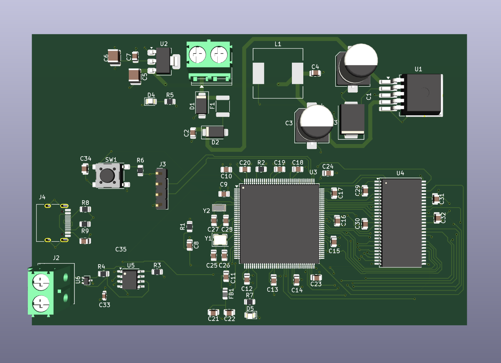
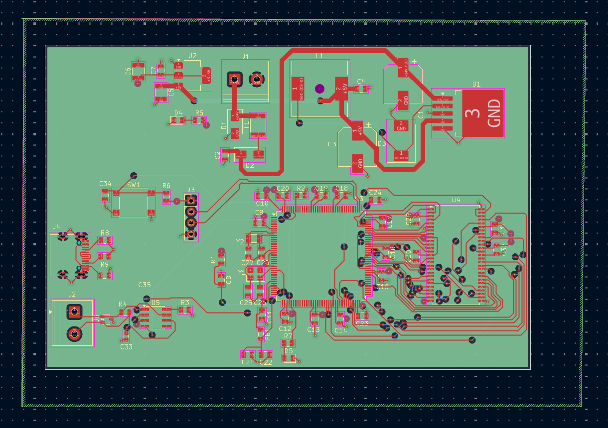

# Gateway-X6 — 6 Katmanlı STM32 Yüksek Hızlı Donanım Tasarımı

Gateway-X6; STM32 mikrokontrolcü mimarisi, harici SDRAM arayüzü ve endüstriyel haberleşme hatlarını bir araya getiren, sinyal bütünlüğü (Signal Integrity) ve güç dağıtımı (Power Distribution) önceliklendirilerek tasarlanmış 6 katmanlı (6-layer) bir PCB projesidir.

---

## 📸 Proje Görselleri

### 1. 3D Kart Görünümü


### 2. PCB Katman Çizimi ve Yönlendirme


### 3. Şematik Tasarım


---

## Proje Motivasyonu ve Öğrenim Hedefleri

Bu proje; hem profesyonel donanım tasarımı standartlarını pratiğe dökmek hem de karmaşık mimarilerle çalışırken karşılaşılan zorlukları bizzat tecrübe etmek amacıyla geliştirilmiştir:

- **STM32 Tasarım Standartları:** STM32 mikrokontrolcü ekosisteminin yüksek hızlı çevre birimleri, kristal osilatör hatları ve decoupling (dekaplaj) kondansatör yerleşim standartlarını derinlemesine uygulamak.
- **6 Katmanlı Yığın Yapısı (Stackup):** 2 veya 4 katmanlı yapıların ötesine geçerek, gürültü bağışıklığı ve kesintisiz referans düzlemleri (GND/PWR plane) sunan 6 katmanlı mimariyi deneyimlemek.
- **Sinyal ve Adres Hatlarında Karmaşıklık Yönetimi:** STM32 ile SDRAM arasındaki FMC (Flexible Memory Controller) arayüzünde yer alan onlarca yüksek hızlı veri, adres ve kontrol hattını (FMC_SDCKE, FMC_SDCLK vb.) çakışmasız, izole ve doğru pin eşlemeleriyle yönlendirmek; bu süreçteki etiketleme (net management) ve adresleme karmaşıklıklarını büyük bir sabır ve hassasiyetle çözmek.

---

## Katman Mimarisi (6-Layer Stackup)

Kartın sinyal bütünlüğünü korumak ve EMC/EMI performansını artırmak için aşağıdaki katman dizilimi uygulanmıştır:

1. **Top Layer (`F.Cu`):** Yüksek Hızlı Sinyaller ve Komponent Yerleşimi
2. **GND Plane (`GND`):** Üst Katman İçin Kesintisiz Toprak Referans Düzlemi
3. **Inner Signal (`SIG1`):** İç Sinyal Yönlendirme Katmanı
4. **GND2 Plane (`GND2`):** Güç Katmanı İçin İkincil Toprak Düzlemi
5. **Power Plane (`PWR`):** $+3.3\text{V}$ Besleme Düzlemi
6. **Bottom Layer (`B.Cu`):** Alt Sinyaller ve Kalın Güç Yolları ($+24\text{V}$, $+5\text{V}$)

---

## Güç Mimarisi ve Yönlendirme

- **$+24\text{V}$ Filtreli Endüstriyel Giriş:** Giriş gürültülerini bastıran filtreleme yapısı ve $1.0\text{ mm}$ kalınlığında yüksek akım hatları.
- **Kademeli Regülasyon:** $+24\text{V} \rightarrow +5\text{V}$ ve $+5\text{V} \rightarrow +3.3\text{V}$ ana hatlar üzerinden kararlı voltaj dağıtımı.
- **Hassas Sinyal İzolasyonu:** Hızlı saat hatları (FMC_SDCLK) ve kontrol hatları, hata ayıklama (SWCLK) ve güç hatlarından izole edilerek cross-talk (çapraz gürültü) engellenmiştir.

---

## Proje Dizin Yapısı

```text
Gateway-X6/
├── Hardware/               # KiCad şematik ve PCB çizim dosyaları (.kicad_sch, .kicad_pcb)
├── Production/             # Üretime hazır Gerber ve Drill ZIP dosyaları
├── Docs/                   # Şematik PDF çıktıları ve teknik dokümanlar
├── Images/                 # Proje görselleri (Gateway-X6.3d.png, Gateway-X6.pcb.png, Gateway-X6.kch.png)
├── .gitignore
└── README.md
